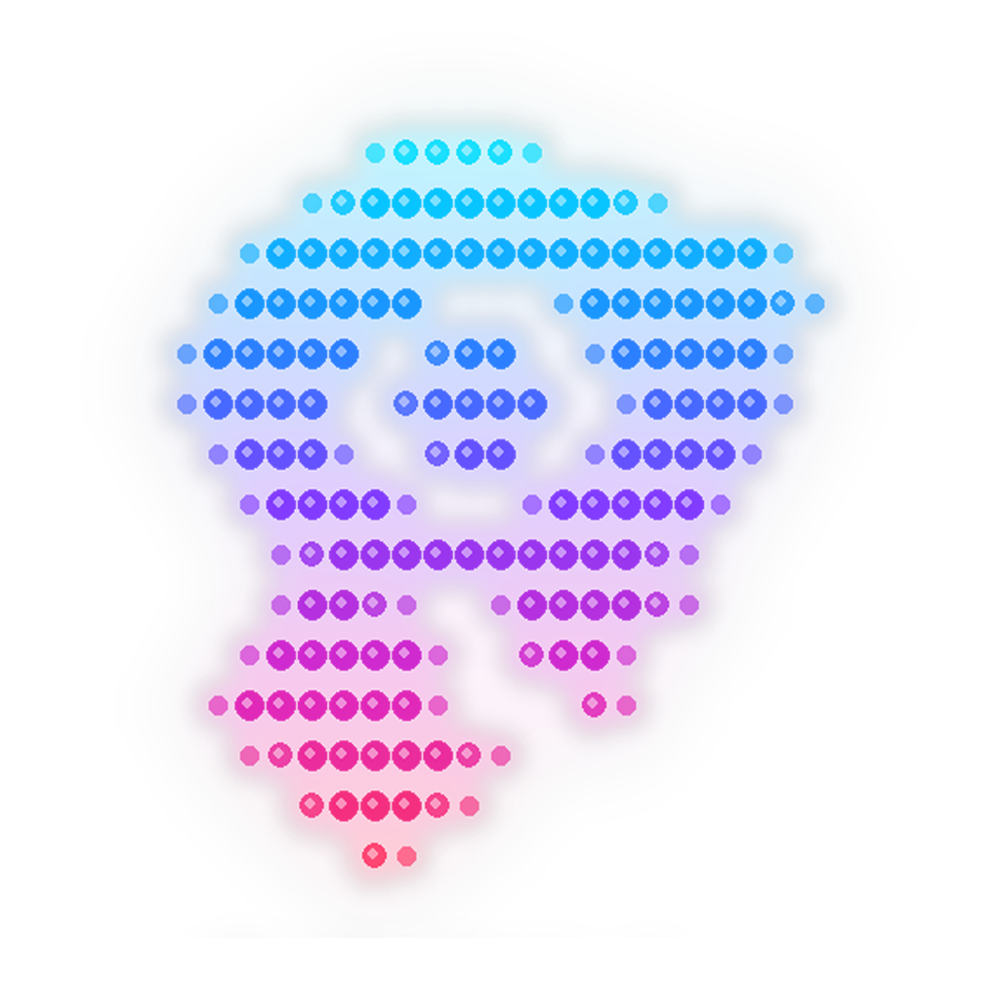

  

<h1 align="center">Torch - Observability</h1>

@Maintained by: #Author

---

## About

This project is a deep learning project built on PyTorch that leverages time-series data collected from an observability stack's own components (Alloy, Mimir, Loki...) to forecast its overall behavior. By training on historical metrics persisted as daily Parquet chunks in Azure Blob Storage, the model aims to enable proactive failure detection, reduces mean time to understanding during incidents, and contributes to improving the global reliability of the platform's services.

__Disclaimer: We are not data scientists, so there is obviously room for improvement.__

## Complete Documentation

| Document | Description |
|----------|-------------|
| [Architecture](.docs/architecture.md) | Project architecture & data pipeline |
| [Dev Practices](.docs/dev-practices.md) | Developer guide & best practices |
| [Local Stack](.docs/local-stack.md) | Local Docker Compose stack (Grafana, Alloy, Prometheus, Loki) |
| [Runbook](.docs/runbook.md) | Operational procedures & caveats |
| [QA](.docs/qa.md) | Quality assurance |

---